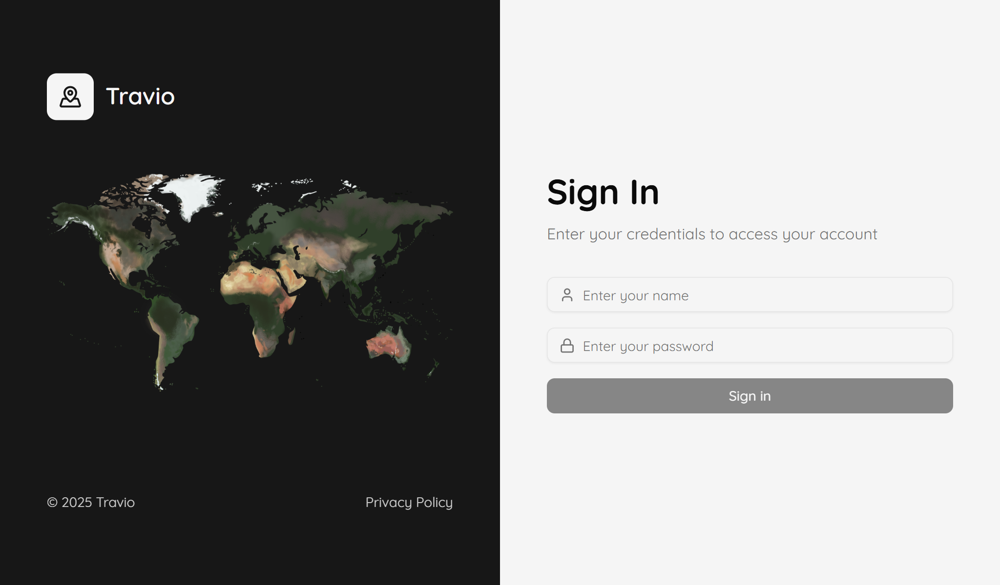
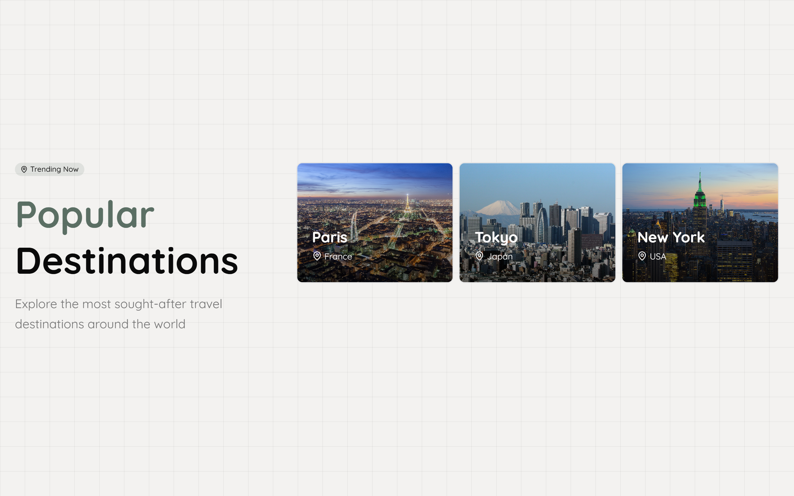
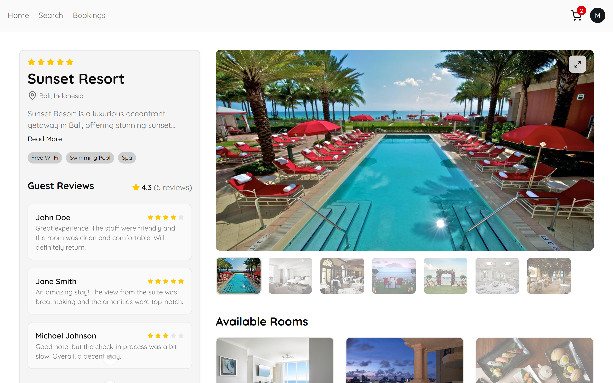
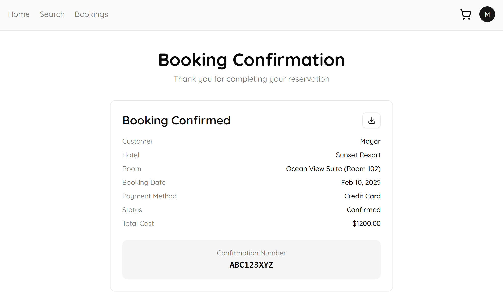

# ✈️ Travio — Travel and Accommodation Booking Platform

## Project Overview

Travio is a comprehensive, high-performance web application designed to streamline the entire process of searching, booking, and managing hotel accommodations. Developed during a Frontend Internship at **Foothill Technology Solution**, this platform offers a seamless experience for both travelers and administrators, built with modern frontend architecture and a strong focus on type safety and code quality.

## 📄 Software Requirements Specification (SRS)

You can download the full [Software Requirements Specification (SRS) document](https://drive.google.com/file/d/1zKk3PvI_4MWlQU-QEdTGpaaMcSNuWcDV/view?usp=sharing) here.

## ✨ Key Features

The platform consists of two main interfaces, delivering a full-featured solution:

- **User Interface:**  
  Allows travelers to effortlessly search for hotels using advanced filters such as price, rating, and amenities. Interactive maps display hotel locations and nearby attractions, enhancing discovery. The booking process is secure and user-friendly, featuring a multi-step form validated with robust tools. Upon confirmation, users instantly receive downloadable PDF booking summaries.

- **Admin Interface:**  
  Provides administrators with full control to create, view, update, and delete data for cities, hotels, and rooms, ensuring efficient content management and up-to-date listings.

## 🎥 Application Demo Video

[](https://drive.google.com/file/d/1ohxE6NDcIb2LcTNheaA2wUwZYJ1KxzBh/view?usp=sharing)

Or click here to watch the [full demo video](https://drive.google.com/file/d/1ohxE6NDcIb2LcTNheaA2wUwZYJ1KxzBh/view?usp=sharing)

## 🛠️ Technical Stack: Built for Performance and Developer Experience

Travio is built on a carefully selected stack of modern tools that optimize performance and maintainability. For a detailed description of the full technical stack and tools used, please refer to the [(SRS) document](https://drive.google.com/file/d/1zKk3PvI_4MWlQU-QEdTGpaaMcSNuWcDV/view?usp=sharing)

- **React 19 & TypeScript:** Building scalable, type-safe user interfaces that catch errors early and enhance developer productivity.  
- **Tailwind CSS & ShadCN UI:** Delivering fast, consistent, and accessible styling with a utility-first approach.  
- **Zustand & TanStack Query:** Managing complex application state and server-side data fetching efficiently.  
- **Formik & Yup:** Handling form state and validation robustly for smooth user interactions.  
- **React Router (v7):** Enabling intuitive and seamless client-side navigation.


## 🚀 Ensuring Code Quality and Developer Efficiency

Maintaining a clean and reliable codebase was a priority, supported by modern tooling:

- **Biome:** A fast and unified linter and formatter replacing ESLint and Prettier, ensuring consistent code style across the team.  
- **Husky & lint-staged:** Running pre-commit checks on staged files automatically to prevent low-quality code from entering the repository.  
- **Jest & React Testing Library:** Comprehensive testing focused on user interactions to guarantee feature reliability.  
- **Vite:** Providing an ultra-fast development server and optimized builds for production.  
- **VS Code:** The primary IDE, harnessing powerful debugging and TypeScript support for efficient development.

## 📸 Screenshots
### Login 


### User-facing Pages

#### Home Page  


#### Featured Deal  


#### Recent Visit  


#### Popular Destination  


#### Search Page


#### Filter Sidebar


#### Hotel Page


#### Cart Page


#### Empty Cart


#### Checkout Page


#### Confirmation Model


#### Confirmation Page


#### No Booking 


---

### Admin Pages

#### Hotel Page


#### Rooms Page


#### Cities Page


#### Edit Hotel


#### Delete Hotel


#### Create Hotel


---


## ⚙️ Installation and Setup

To get started locally, follow these steps:

1. **Clone the repository:**
    ```bash
    git clone [Your Repository URL]
    cd travio
    ```
2. **Install dependencies:**
    ```bash
    pnpm install
    # or npm install / yarn install
    ```
3. **Start the development server:**
    ```bash
    pnpm dev
    ```
The application will be accessible at `http://localhost:5173` (or similar).

---

*Developed during a Frontend Internship at Foothill Technology Solution.*
